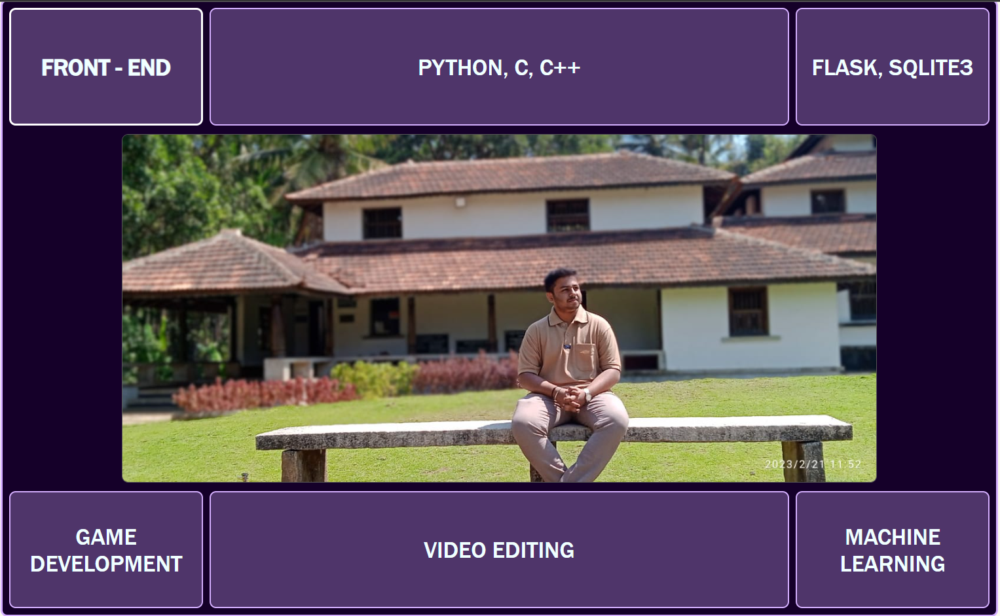

# Pavan's Portfolio
## Bharat Intern task 2

## Introduction
This is a personal portfolio website project. The portfolio showcases my Pavan's skills, projects, and provides insights into both professional and personal aspects of my life. It serves as a platform to display my work and connect with others in the field.

## Table of Contents
- [Technologies Used](#technologies-used)
- [Project Structure](#project-structure)
- [Screenshots](#screenshots)
- [Features](#features)
- [Contact Information](#contact-information)

## Technologies Used
- HTML
- CSS
- Font Awesome (for icons)

## Project Structure
The project structure consists of the following main sections:

- **Home Section**: The landing page containing a navigation bar and a grid-based layout showcasing various aspects of my skills and interests.

- **About Me Section**: Provides information about my professional and personal life, including education, interests, and hobbies.

- **Skills Section**: Displays my proficiency in various fields, such as web development, programming, and game development, along with progress bars indicating skill levels.

- **Projects Section**: Showcases a collection of projects, each with a brief description, links to GitHub repositories, and live demo (where available).

- **Contact Me Section**: Displays links to my social media profiles and email address for contact.

## Screenshots

## Features
- Interactive navigation bar with smooth scrolling to different sections of the portfolio.
- Hover effects on navigation items for better user experience.
- A grid-based layout for showcasing skills, with progress bars indicating skill levels.
- Responsive design to ensure the website looks good on various screen sizes.
- Detailed project descriptions with links to GitHub repositories and live demos.
- Hover effects on project items for better user engagement.
- Links to Pavan's social media profiles for easy contact.

## Contact Information
GitHub: PavanBhat007

Twitter: @KSPavanBhat1

Instagram: ksp_bhat

LinkedIn: Pavan Ks Bhat

Email: pvn.24.offi@gmail.com

Feel free to reach out for any inquiries or collaborations!
